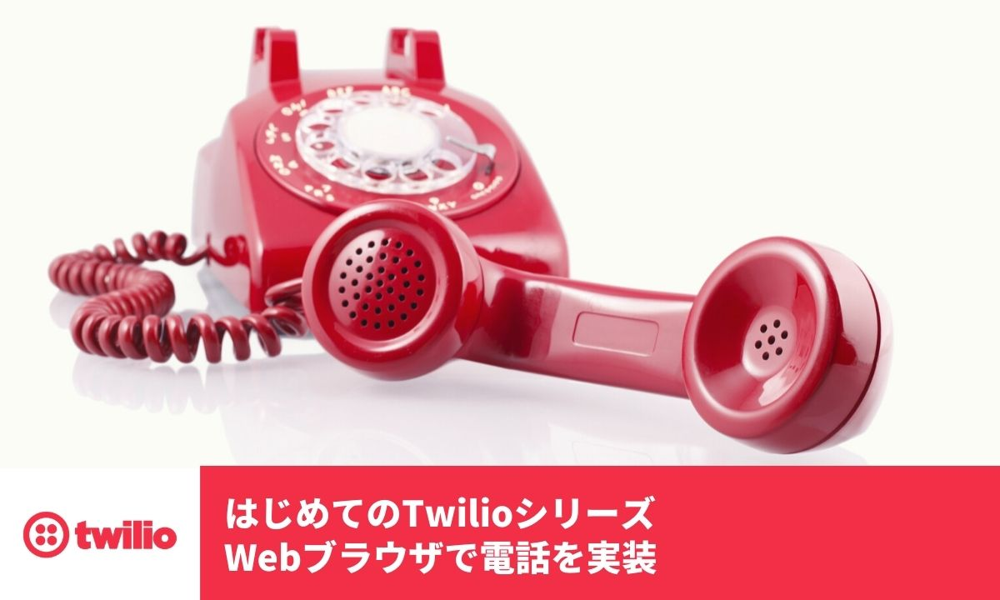

# Twilio-HandsOn-Voice-TwiML-APP-JP

[Twilio Programmable Voice](https://www.twilio.com/ja/voice)を用いてブラウザフォンを構築するハンズオン手順書です。

## 必要・推奨環境
このハンズオンを実施する場合は、下記の記事に従いTwilioアカウントの作成が必要となります。

- [Twilioアカウントの作成方法](https://www.twilio.com/blog/how-to-create-twilio-account-jp)

## ハンズオン

- [ハンズオン: 電話番号の取得](docs/01-Get-Phone-Number/00-Overview.md)
- [ハンズオン: TwiML Appの作成とAPIキー/APIシークレットの生成](docs/02-TwiML-App-API-Key-Secret/00-Overview.md)
- [ハンズオン: Twilio Functionsを利用したアクセストークンの生成](docs/03-Generate-Access-Token/00-Overview.md)
- [ハンズオン: Twilio Clientの初期化と発信](docs/04-Client-Outbound-Calls/00-Overview.md)
- [ハンズオン: Twilio Clientで着信に応答](docs/05-Client-Incoming-Calls/00-Overview.md)

