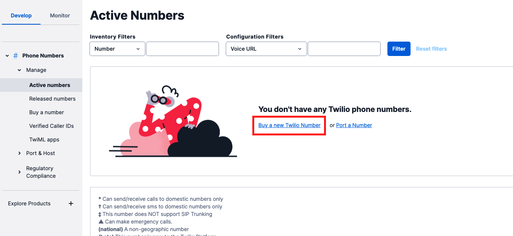
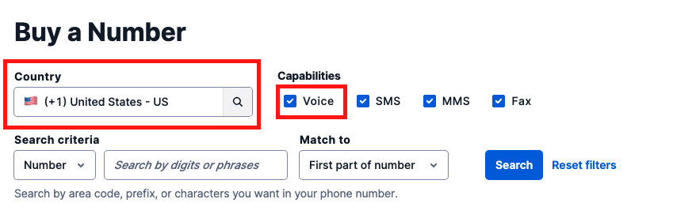
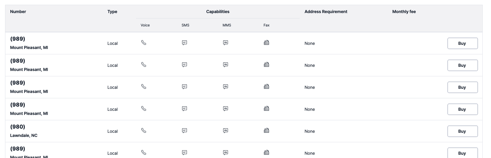

#  手順1: 電話番号の取得

この手順では、Twilioが提供する電話番号を取得します。Twilio番号をすでに持っている場合はこの項目をスキップしてください。

[Twilioコンソール](https://jp.twilio.com/console/phone-numbers/incoming)を開き`Buy　a　new　Twilio Number`リンクをクリックします。

次の画面で購入可能な電話番号を検索できます。日本の番号を取得する場合、本人確認作業が発生します。本人確認作業は数時間〜数日を要するため、時間がない場合は米国番号を取得します。

電話番号を購入した場合、回線維持料金が必要になります。国、電話番号の種類により料金が変わります。ただしトライアルアカウントの場合、トライアル用の無料クレジットが使用されるため追加費用を支払う心配はありません。

`COUNTRY`欄をUnited Statsと設定し、`機能`欄の`Voice`にチェックを入れ、`検索`ボタンをクリックします。

購入可能な番号一覧が表示されます。

好きな番号を選び、`購入`ボタンを押し、月額費用を確認の上、購入してください。前述の通り、トライアルアカウントの場合は無料クレジットが付与されているため、費用の請求はありません。

取得した番号を[E.164フォーマット](https://jp.twilio.com/docs/glossary/what-e164)で控えておきます。

---

## 参考情報

### トライアルアカウントの制限 ###

トライアルアカウントを利用した場合、下記のような制限があります。
- トライアルアカウント購入できる電話番号は１番号のみです。
- 電話/SMSの発信は登録された電話番号のみに行えます。

制限の詳細やアカウントのアップグレードについてはこちらをご覧ください。
- [Twilio フリートライアルアカウントに関して](https://support.twilio.com/hc/en-us/articles/360044841214-Twilio-%E3%83%95%E3%83%AA%E3%83%BC%E3%83%88%E3%83%A9%E3%82%A4%E3%82%A2%E3%83%AB%E3%82%A2%E3%82%AB%E3%82%A6%E3%83%B3%E3%83%88%E3%81%AB%E9%96%A2%E3%81%97%E3%81%A6)

### 日本番号の取得について ###

日本の番号を購入する場合は住所ならびに[本人情報を本人書類を添えて登録](https://support.twilio.com/hc/en-us/articles/360044400214)し、本人確認が必要です。この手続きには数時間から数日を要します。

### CLIを利用した番号の取得 ###

このハンズオンでは[コンソール](https://jp.twilio.com/console)（Web UI）を用いて作業を進めます。一方、番号の購入や設定をコマンドで実行できるCLIも提供しています。

こちらに興味がある場合は下記のハンズオンもご覧ください。

- [Twilio-HandsOn-CLI-JP](https://neri78.github.io/Twilio-HandsOn-CLI-JP/)

## 次のハンズオン

- [ハンズオン: TwiML Appの作成とAPIキー/APIシークレットの生成](../02-TwiML-App-API-Key-Secret/00-Overview.md)