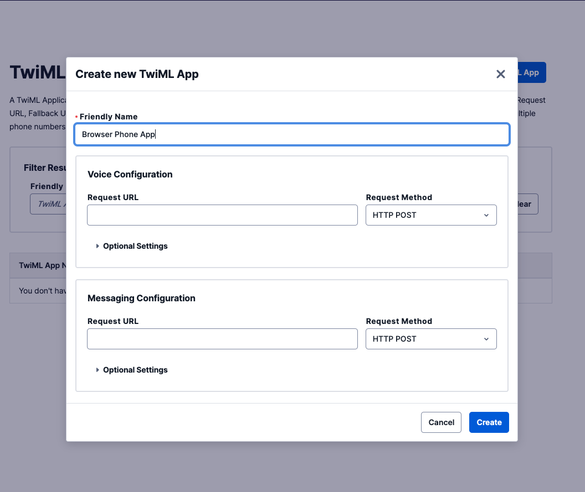

#  手順1: TwiML Appの作成

TwiML Appを利用すると受発信をカスタムアプリケーションで制御できるようになります。この手順ではTwiML Appをコンソールで作成する方法を学習します。

## 1-1: コンソールでTwiML Appを作成

[Programmable Voiceコンソール](https://www.twilio.com/console/voice/twiml/apps)のTwiMLセクションを開き、`Create new TwiML App`ボタンをクリックします。

`FRIENDLY NAME`にわかりやすい名前を入れ、それ以外は空欄のまま、`Create`ボタンをクリックします。

作成後、TwiML Appの一覧が表示されるので先ほど作成したAppの名前をクリックし、詳細画面を表示します。

画面に表示される`SID`を控えておきます。

ここで作成したTwiML Appを用いてブラウザフォンを実装します。

## 次の手順

[手順2: APIキーおよびAPIシークレットの生成](02-Generate-API-Key-Secret.md)