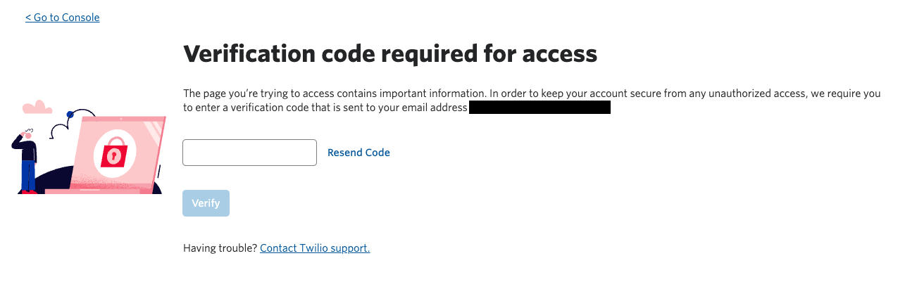
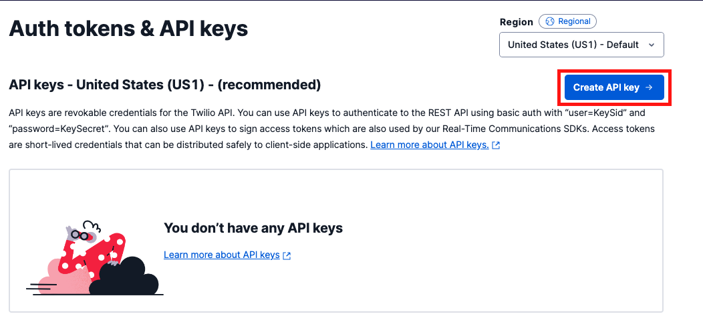

#  手順2: APIキーおよびAPIシークレットの生成

この手順ではTwilioサービスを利用するために必要なAPIキーおよびAPIシークレットを生成します。生成された情報はアクセストークンの生成時に利用します。

コンソールから[Authトークン&APIキー画面](https://www.twilio.com/console/project/api-keys/)を表示します。この際、本人確認のため、アカウントに登録されているメールアドレスに検証コードが送信されます。送られてきたコードを入力し、`Verify`ボタンをクリックします。

続いて遷移した画面の右に表示されている`Create API key`ボタンをクリックします。

`Friendly name`の欄に任意の名前を入力し、`Region`は`United States (US1) - Default`、`Key type`は`Standard`とします。全ての入力・選択を確認したのち、`Create API Key`ボタンをクリックします。

作成された画面に表示されている、`SID`と、`Secret`を控えておきます。`Secret`はこの画面のみに表示されるため注意してください。

## 次の手順

[ハンズオン: Twilio Functionsを利用したアクセストークンの生成](../03-Generate-Access-Token/00-Overview.md)