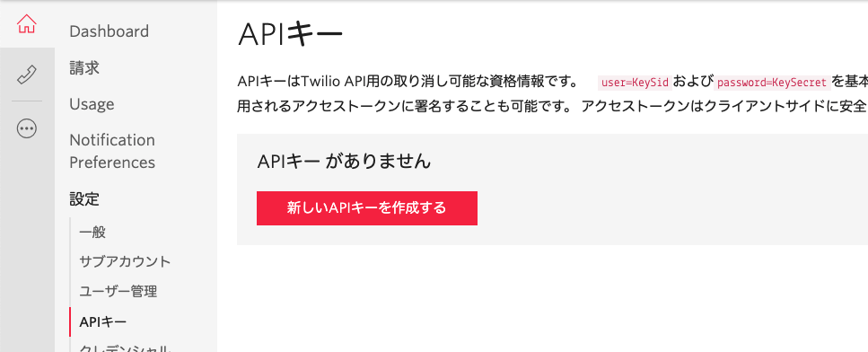
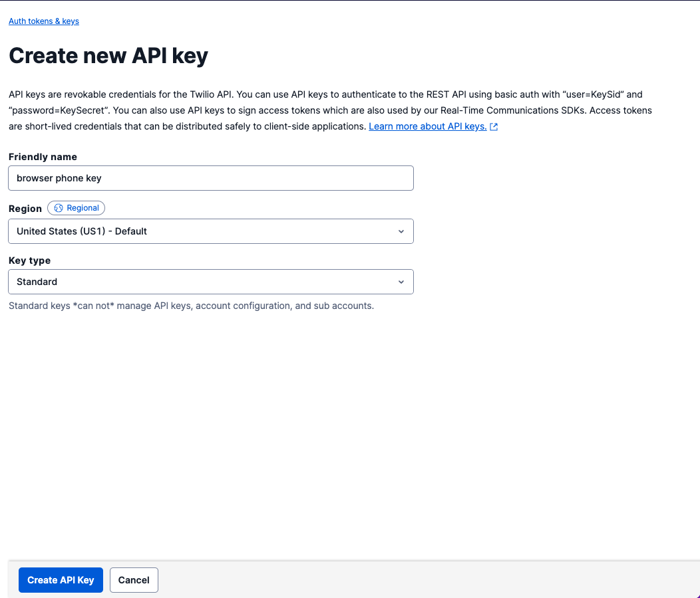
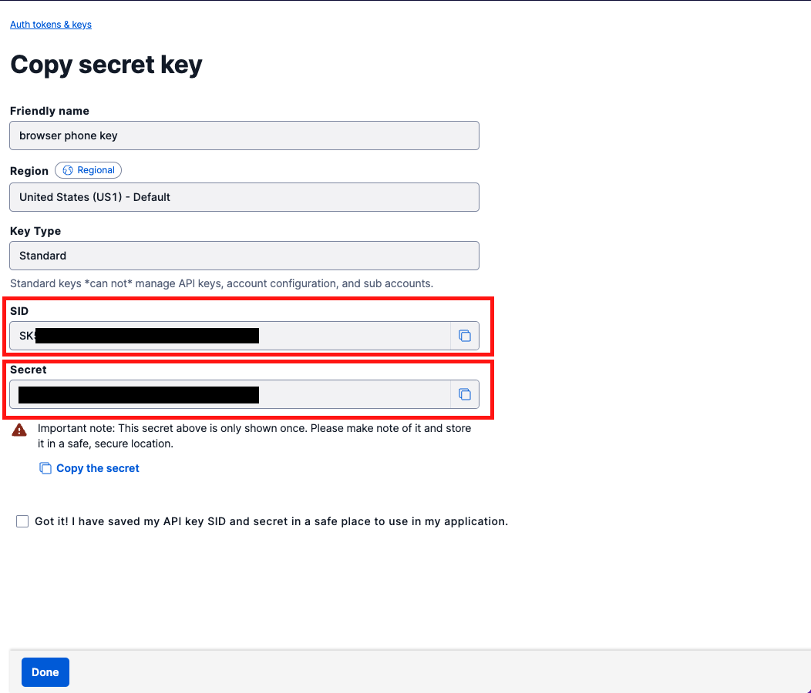

#  手順2: APIキーおよびAPIシークレットの生成

この手順ではTwilioのサービスを利用するために必要なAPIキーおよびAPIシークレットを生成します。生成された情報はアクセストークンの生成時に利用します。

[コンソール - Dashboard](https://jp.twilio.com/console/project/settings)の`設定`からAPIキーを作成します。

[APIキー](https://jp.twilio.com/console/project/api-keys)を選択し、`新しいキーを作成する`ボタンをクリックします。

`わかりやすい名前`の欄に任意の名前を入力し、キータイプは`Standard`とし、`APIキーを作成する`ボタンをクリックします。

作成された画面に表示されている、`SID`と、`SECRET`を控えておきます。

## 次の手順

[ハンズオン: Twilio Functionsを利用したアクセストークンの生成](../03-Generate-Access-Token/00-Overview.md)