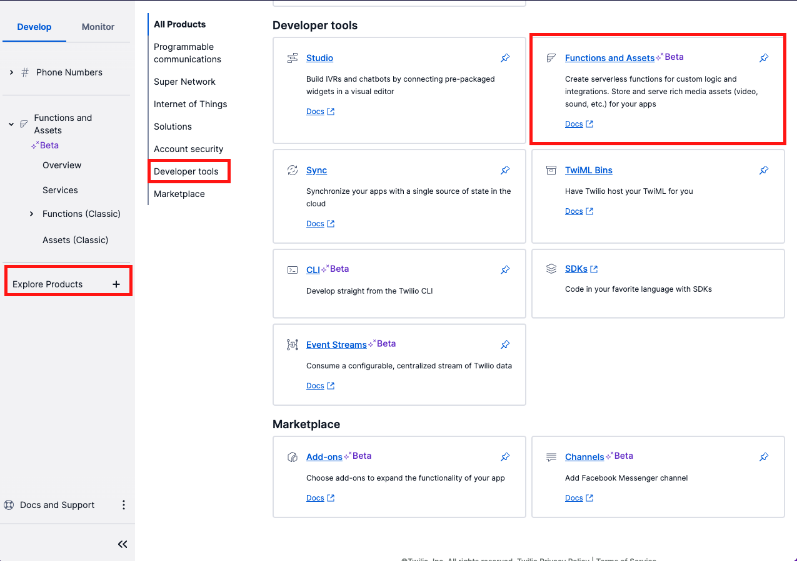
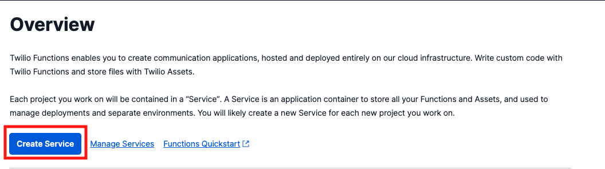

#  手順1: Twilio Functionの作成

この手順では[Twilio Functions](https://www.twilio.com/docs/runtime/functions)を用いてサーバーレス実行環境を作成します。

Twilio FunctionsはWebhook（Webアプリケーション）を利用する方法に比べて次の利点があります。

- サーバーレス実行環境を利用できるため、ローカル環境や別のクラウド環境でWebアプリケーションをホスティングする必要がない。
- セキュアかつ、オートスケーリング機能が提供されている。
- [Twilio RESTヘルパーライブラリー](https://www.twilio.com/docs/libraries/node)が環境にあらかじめ組み込まれている。

## 手順2-1: サービスを作成

[Functions and Assets](https://www.twilio.com/console/functions)を直接開くか、[Explore Products](https://console.twilio.com/develop/explore)から`Functions and Assets`を選択します。



Overview画面から`Create Service`ボタンをクリックし新しいサービスを作成します。



最初にサービスの名前を入力します。この名前はURLの一部として利用されるため、そちらを意識し設定してください。


## 2-2: Functionを追加

新たにサービスを作成するとUIベースのエディタ画面が表示されます。画面の`Add +`ボタンをクリックし、`Add Function`を選択します。


Functionのパス設定を求められます。ここではアクセストークンを生成するため`/token`と設定します。


デフォルトでここで作成したFunctionは`Protected`と設定されます。この場合、Functionの実行には[有効なTwilioリクエスト署名](https://www.twilio.com/docs/runtime/functions-assets-api/api/understanding-visibility-public-private-and-protected-functions-and-assets#protected)が必要となり、外部からのアクセスを抑制できます。今回のハンズオンでは実行結果を簡単に確認するため、Functionパスを`Public`と設定します。


------
Functionパスのアクセスレベルを`Public`と指定した場合は外部からのリクエストを全て許可することになります。今回のアクセストークンと自分が保有するTwilio番号を使うと音声通話の発信・着信が可能となるため、トークン発行の前に認証する、トークンの生存期間を可能な限り短くする、などの対策が必要となります。

-----


作成したFunctionにはあらかじめ下記のコードが実装されています。この例はコメントを日本語に意訳し、必要に応じて追記しています。

```js
// これは新しいfunctionです。左のパスを変更できます。
exports.handler = function(context, event, callback) {
  // このfunctionで返すTwiMLの例です。
  let twiml = new Twilio.twiml.VoiceResponse();
  // Hello Worldと発音します。
  twiml.say('Hello World');
    
  let variable = 'welcome!';

  // コンソールにログを残すこともできます。
  console.log('error', variable);

  // callbackを返し、functionの呼び出しを終了します。
  // 正常に終了した場合は、第1引数はnullになります。
  // 必要に応じてTwiMLなど第2引数以降で返します。
  return callback(null, twiml);
};
```

ハンドラーの中身を次のようにクリアします。

```js
exports.handler = function(context, event, callback) {

  return callback(null, twiml);
};
```
次の手順ではこのハンドラーでアクセストークンを作成します。

## 次の手順

[手順2: アクセストークンの生成](02-Generate-Access-Token.md)