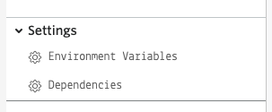
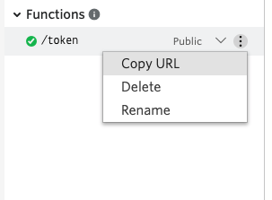

#  手順2: アクセストークンの生成 

この手順ではTwilio Functionを使用し、アクセストークンを生成します。

## 2-1: 環境変数に値を追加

`Settings`の`Environment Variables`を開きます。



この画面では環境変数を指定できます。先ほど控えたそれぞれの値を次の`KEY`名で追加します。

|  KEY  |  VALUEに設定する値  |　
| ---- | ---- |
|  TWIML_APP_SID  |  TwiML Appを作成した際に生成されたSID  |
|  API_KEY  |  APIキーの値  |
|  API_SECRET  |  APIシークレットの値  |

環境変数を追加すると画面に表示されます。


## 2-2: Twilio Clientの識別子を設定し、アクセストークン、VoiceGrant（音声機能の許可）を取得

Twilio Clientを利用する場合、識別子が必要となります。今回は固定の値を使用しますが、複数人で利用する場合は個別の識別子を生成する仕組みを追加してください。

`/token`パスを再度表示し、下記のスニペットに従い、識別子とアクセストークン、音声機能の許可（VoiceGrant）をオブジェクトを取得します。

```js
exports.handler = function(context, event, callback) {

  // 今回追加部分
  // クライアントの識別子を設定。
  // 今回は固定だが、複数のクライアントに対応するためにはこちらを可変にする。
  const identity = 'user';
  
  // 今回追加部分
  //アクセストークン、音声機能の許可（VoiceGrant）を取得。
  const AccessToken = Twilio.jwt.AccessToken;
  const VoiceGrant = AccessToken.VoiceGrant;

  
  return callback(null, twiml);
};
```

## 2-4: VoiceGrantを発信専用で設定

次に`TWIML_APP_SID`を外部発信のアプリケーション SIDとし、着信を不許可としたVoiceGrantオブジェクトを作成します。

```js
exports.handler = function(context, event, callback) {

  const client = context.getTwilioClient();

  const identity = 'user';
  
  const AccessToken = Twilio.jwt.AccessToken;
  const VoiceGrant = AccessToken.VoiceGrant;

  // 今回追加分 
  // 外部発信のみ許可
  const voiceGrant = new VoiceGrant({
      outgoingApplicationSid: context.TWIML_APP_SID,
      incomingAllow: false
  });
  
  return callback(null, twiml);
};
```

## 2-5: アクセストークンを生成し、VoiceGrantを割り当て

`ACCOUNT_SID`、`API_KEY`、`API_SECRET`、`identity`を用いてアクセストークンを生成したのち、続けて先ほど作成したVoiceGrantを設定します。

```js
exports.handler = function(context, event, callback) {

  const identity = 'user';
  
  const AccessToken = Twilio.jwt.AccessToken;
  const VoiceGrant = AccessToken.VoiceGrant;

  const voiceGrant = new VoiceGrant({
      outgoingApplicationSid: context.TWIML_APP_SID;
      incomingAllow: false
  });

  // 今回追加分 
  // アクセストークンの生成
  const token = new AccessToken(
      context.ACCOUNT_SID,
      context.API_KEY,
      context.API_SECRET,
      { identity: identity}
  );

  // 今回追加分 
  // トークンに許可した機能を定義
  token.addGrant(voiceGrant);

  
  return callback(null, twiml);
};
```

## 2-6: アクセストークンをレスポンスとして送信

最後に`toJwt()`メソッドを使用し、コールバックでアクセストークンを送信します。

```js
exports.handler = function(context, event, callback) {

  const identity = 'user';
  
  const AccessToken = Twilio.jwt.AccessToken;
  const VoiceGrant = AccessToken.VoiceGrant;

  const voiceGrant = new VoiceGrant({
      outgoingApplicationSid: TWIML_APP_SID;
      incomingAllow: false
  });

  const token = new AccessToken(
      ACCOUNT_SID,
      API_KEY,
      API_SECRET,
      { identity: identity}
  );

  token.addGrant(voiceGrant);

  // 今回変更分
  // コールバック関数でtokenを返す
  return callback(null, { token: token.toJwt()});
};
```

`Save`ボタンで保存後、`Deploy All`ボタンをクリックしてFunctionをデプロイします。

デプロイ後、PathのURLをブラウザで開いてください。


`token`の値を[jwt.io](https://jwt.io/)でデコードするとidentityやVoiceGrantの値を確認できます。

これでブラウザからTwilioの機能を利用するためのアクセストークンを生成できました。次のハンズオンではフロント側アプリケーションを実装します。

## 次のハンズオン

[ハンズオン: Twilio Clientの初期化と発信](../04-Client-Outbound-Calls/00-Overview.md)