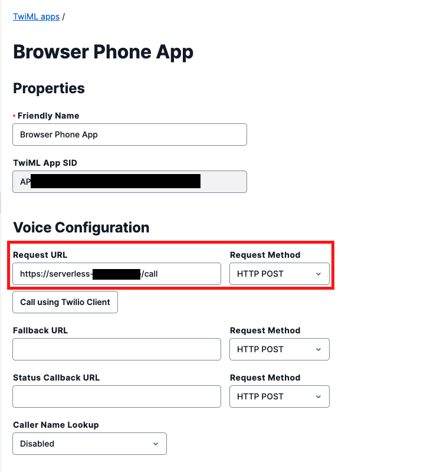

#  手順1: サーバー側の実装 - TwiML Appからの発信リクエストをハンドル

この手順は先ほどに引き続き、Twilio Functionに新しいFunction Pathを追加し、TwiML Appからの発信要求に対応するロジックを実装します。

## 1-1: 電話番号を環境変数に追加

前のハンズオンで作成した`Function`のエディタ画面で再度`Environment Variables`を開き、次の変数を追加します。  

| KEY | VALUEに設定する値 |　
| :---- | :---- |
|  PHONE_NUMBER | 購入した番号（E.164フォーマット）|  


## 1-2: /callパスを追加し、TwiMLを返すロジックを実装

続けて新しいFunction Path `call`を追加します。このPathはTwiML App（Twilio内部）からのみ呼び出されるため、アクセスレベルは`Protected`としておきます。


`/call`では購入したTwilio番号を用いてリクエストから渡された番号（`event.number`）に発信するTwiMLを返すコードを実装します。

```js
exports.handler = function(context, event, callback) {
  
  const VoiceResponse = Twilio.twiml.VoiceResponse;
  
  // Voice用TwiMLを作成
  const voiceResponse = new VoiceResponse();

  // 番号を取得
  const number = event.number;

    // Dial句を使用
  const dial = voiceResponse.dial({callerId: context.PHONE_NUMBER });
  
  // 取得した番号に発信
  dial.number(number);
  
  // TwiMLを送信
  return callback(null, voiceResponse);
};
```

`Save`後デプロイし、この `/call`のURLを控えます。

## 1-3: TwiML App からTwilio Functionsを呼び出し

先ほど作成したTwiML Appの設定画面を開き、`Voice` - `REQUEST URL`に`/call`のURLを指定し、Saveします。



これでTwiML Appから通話要求が発生した場合に`/call`が呼び出されるようになりました。

次の手順ではクライアント側を実装します。


## 次の手順

[手順2: クライアント側 - Twilio Clientの初期化とイベント処理](02-Client-Twilio-Client.md)
