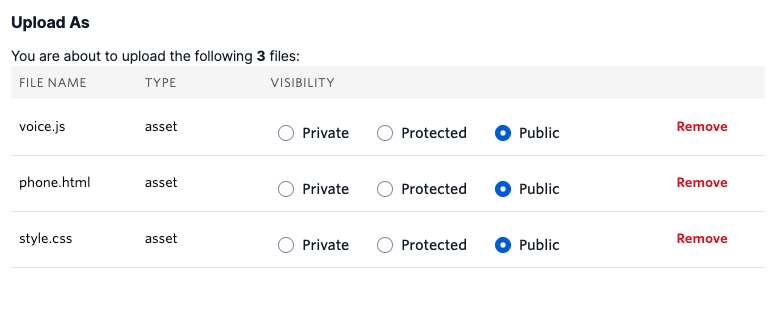
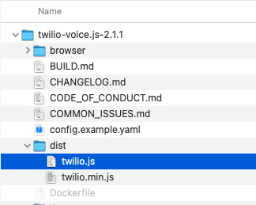
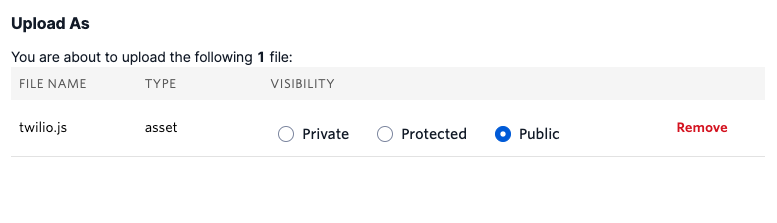

#  手順2: クライアント側の実装

この手順では事前に用意されているWebアプリケーションを[Twilio Assets](https://www.twilio.com/docs/runtime/assets)にアップロードし、発信機能を実装します。このTwilio AssetsはTwilioが提供するファイルストレージです。

## 2-1:Webアプリケーション用のファイルをTwilio Assetsにアップロード

あらかじめクライアント側のWebアプリケーションが用意されています。下記のリンクからファイルをダウンロードし、解凍します。

[ダウンロード - Webアプリケーション](../../samples/phone.zip)

次に先ほどから実装しているTwilio Functionsのエディタ画面を開き、`Add +`ボタンから`Upload File`を選択します。


下記のファイルを選択し、アップロードします。その際、`VISIBILITY`を`Public`と設定します。

|  FILE NAME  |  VISIBILITY  |　
| ---- | ---- |
|  style.css  |  Public  |
|  voice.js  |  Public  |
|  phone.html  |  Public  |




`Upload`ボタンをクリックし、アップロードを完了させます。


## 2-2: JavaScript用SDKをAssetsにアップロード

WebアプリケーションからTwilio Clientを利用する場合、JavaScript用SDKを利用します。[ドキュメント](https://www.twilio.com/ja/docs/voice/sdks/javascript)に取得方法が紹介されていますが、今回は[GitHub](https://github.com/twilio/twilio-voice.js)から直接ダウンロードします。下記のリンクをダウンロードし、zipファイルを展開します。

[@twilio/voice-sdk - 2.1.1](https://github.com/twilio/twilio-voice.js/archive/refs/tags/2.1.1.zip)

展開したファイル群のなかから`dist/twilio.js`ファイルを先ほどと同様にTwilio Assetsにアップロードします。下記のスクリーンショットを参考にしてください。



こちらもVisibilityを`Public`と設定します。



-----------------

このファイルは`index.html`で参照されており、`voice.js`で使用します。参考のため、参照部分のコードを下記に記します。

```html
<html>
    <head>
        <!--assetにアップロードしたTwilio Voice JavaScript SDKを読み込み-->
        <script type="text/javascript" src="/twilio.js"></script>
        <link rel="stylesheet" href="/style.css" />
    </head>
    <body>
        <input id="init" type="submit" value="初期化" />
        <form id="dialForm">
            <div>
                <label>発信先：</label>
                <input id="to" type="password" name="number"/>
            </div>
            <div>
                <input id="call" disabled="true" type="submit" value="発信"/>
                <input id="disconnect" disabled="true" type="submit" value="終了"/>
            </div>
        </form>
    </body>

    <script type="text/javascript" src="voice.js"></script>
</html>
```

-----------------

## 2-3: 初期化処理を実装

Assetsに表示されている`voice.js`をクリックするとコードが表示されます。このファイルには初期化ボタンをクリックした際のロジックが実装されています。

```js
// Twilio.Device
let device;

// 初期化ボタンをクリックした際にアクセストークンを取得し、Twilio.Deviceを初期化する。
InitButton.addEventListener('click', async() => {

});
```
ここに`Twilio.Device`の初期化と状態変化によるボタンの活性・不活性処理を実装します。

```js
// 初期化ボタンをクリックした際にアクセストークンを取得し、Twilio.Deviceを初期化する。
InitButton.addEventListener('click', async() => {

    // 今回追加部分
    // アクセストークンを取得
    let response = await fetch('/token', {
        method: 'GET',
        headers: {
            'Content-Type' : 'application/json'
        }
    });
    let {token} = await response.json();

    // アクセストークンを用いて初期化
    device = new Twilio.Device(token);

    // Twilio Clientの準備ができた段階で発信ボタンを有効化
    device.on('registered', () => {
        CallButton.disabled = false;
        InitButton.disabled = true;
    });

    // クライアントを登録
    device.register();

});

```

## 2-3: 発信処理を実装
発信、または終了ボタンをクリックした際はこちらのロジックが呼び出されます。

```js
// 発信ボタンをクリックすると、Twilio.Deviceを用いて通話を開始
dialForm.addEventListener('submit', (event) => {

    event.preventDefault();

    // clickされたボタンのidを取得
    const submitId = event.submitter.id;
        
});
```

クリックされたボタンに応じて発信と終了処理を実装します。

```js
// 発信ボタンをクリックすると、Twilio.Deviceを用いて通話を開始
dialForm.addEventListener('submit', (event) => {

    event.preventDefault();

    const submitId = event.submitter.id;

    // 今回追加部分
    // 発信ボタンがクリックされた場合はTwiML Appに対して入力された番号に発信してもらう。
    if (submitId === 'call') {
        const number = ToField.value;
        CallButton.disabled = true;

        // 番号を指定して発信
        device.connect({
            params: { number: number}
        });
        DisconnectButton.disabled = false;
    }

    // 終了ボタンがクリックされた場合は接続を終了する。
    else if (submitId === 'disconnect') {
        //　全ての接続（通話）を終了
        device.disconnectAll();
        DisconnectButton.disabled = true;
        CallButton.disabled = false; 
    }
});
```

これでクライアント側の実装も完了しました。最後にデプロイを実行してください。

## 2-4: ブラウザフォンをテスト

デプロイ後、`phone.html`のURLをブラウザで開くと次のような画面が表示されます。


初期化ボタンをクリックすると裏側では`Twilio.Device`が初期化されます。

初期化が終了すると`発信`ボタンが有効になります。
`発信先:`ボックスに認証された電話番号を`E.164フォーマット`で入力し、発信ボタンをクリックするとブラウザ、Twilioを介して手元の電話への発信、会話が可能となります。


これで電話発信が可能なブラウザフォンを実装できました。
次のハンズオンでは着信ロジックを実装します。

## 次のハンズオン

[ハンズオン: Twilio Clientで着信に応答](../05-Client-Incoming-Calls/00-Overview.md)