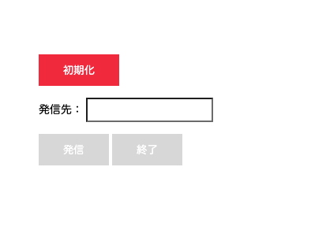

#  手順2: クライアント側 - Twilio Clientの初期化とイベント処理

この手順ではクライアント側で使用するTwilio Clientの初期化とイベント処理を実装します。

## 2-1: 必要なアセットをダウンロードし、エディタで開く

[こちら](../../samples/phone.zip)からダウンロードしたファイルを解凍します。

`phone.html`にはボタンやテキストフィールドが実装されており、[Twilio Client JS SDK](https://jp.twilio.com/docs/voice/client/javascript)や`voice.js`が読み込まれます。



-----
今回のハンズオンで`Twilio Client JS SDK`は利便性のため、CDNからロードされています。しかし、ライブラリのアップデートが自動的に適用されるため実開発では[推奨されていません。](https://jp.twilio.com/docs/voice/client/javascript/overview)

-----

## 2-2: 初期化処理を実装

`voice.js`を任意のテキストエディタで開きます。このファイルには初期化ボタンをクリックした際のロジックが実装されています。

```js
// 初期化ボタンをクリックした際にアクセストークンを取得し、Twilio.Deviceを初期化する。
InitButton.addEventListener('click', async() => {

});
```
ここに`Twilio.Device`の初期化と状態変化によるボタンの活性・不活性処理を実装します。

```js
// 初期化ボタンをクリックした際にアクセストークンを取得し、Twilio.Deviceを初期化する。
InitButton.addEventListener('click', async() => {

    // 今回追加部分
    // アクセストークンを取得
    let response = await fetch('/token', {
        method: 'GET',
        headers: {
            'Content-Type' : 'application/json'
        }
    });
    let {token} = await response.json();
    
    // 今回追加部分
    // アクセストークンを用いて初期化
    Twilio.Device.setup(token);
    // Twilio Clientの準備ができた段階で発信ボタンを有効化
    Twilio.Device.on('ready', () => {
        CallButton.disabled = false;
        InitButton.disabled = true;
    });
});
```

## 2-2: 初期化処理を実装
発信、または終了ボタンをクリックした際はこちらのロジックが呼び出されます。

```js
// 発信ボタンをクリックすると、Twilio.Deviceを用いて通話を開始
dialForm.addEventListener('submit', (event) => {

    event.preventDefault();

    // clickされたボタンのidを取得
    const submitId = event.submitter.id;
        
});
```

クリックされたボタンに応じて発信と終了処理を実装します。

```js
// 発信ボタンをクリックすると、Twilio.Deviceを用いて通話を開始
dialForm.addEventListener('submit', (event) => {

    event.preventDefault();

    const submitId = event.submitter.id;

    // 今回追加部分
    // 発信ボタンがクリックされた場合はTwiML Appに対して入力された番号に発信してもらう。
    if (submitId === 'call') {
        const number = ToField.value;
        CallButton.disabled = true;
        // 番号を指定して発信
        Twilio.Device.connect({ number: number});
        DisconnectButton.disabled = false;
    }

    // 終了ボタンがクリックされた場合は接続を終了する。
    else if (submitId === 'disconnect') {
        //　全ての接続（通話）を終了
        Twilio.Device.disconnectAll();
        DisconnectButton.disabled = true;
        CallButton.disabled = false; 
    }
        
});
```

これでクライアント側の実装も完了しました。次の手順では必要なファイルを[Twilio Assets](https://jp.twilio.com/docs/runtime/assets)にアップロードし、発信をテストします。

## 次の手順

[Twilio Assetsへのアップロードと発信テスト](03-Assets-Outbound-Test.md)