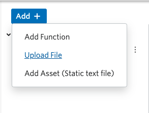
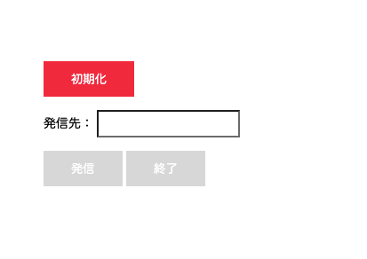
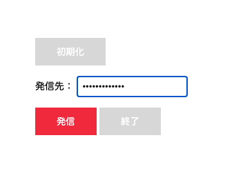

#  手順3: Twilio Assetsへのアップロードと発信テスト

この手順では先ほど実装したクライアント側のファイルを[Twilio Assets](https://jp.twilio.com/docs/runtime/assets)にアップロードします。Twilio AssetsはTwilioが提供するファイルストレージです。

## 3-1:ファイルをアップロードし、デプロイ

先ほどから実装しているTwilio Functionsのエディタ画面を開き、`Add +`ボタンから`Upload File`を選択します。

次のファイルを選択し、それぞれ`VISIBILITY`を`Public`と設定します。

|  FILE NAME  |  VISIBILITY  |　
| ---- | ---- |
|  style.css  |  Public  |
|  voice.js  |  Public  |
|  phone.html  |  Public  |

`Upload`ボタンをクリックし、アップロードを完了させます。まだこの状態ではアクセスできないので、`Deploy All`ボタンでデプロイを行います。

## 3-2: ブラウザフォンをテスト

`phone.html`のURLをブラウザで開くと次のような画面が表示されます。

初期化ボタンをクリックすると裏側では`Twilio.Device`が初期化されます。

初期化が終了すると`発信`ボタンが有効になります。
`発信先:`ボックスに認証された電話番号を`E.164フォーマット`で入力し、発信ボタンをクリックするとブラウザ、Twilioを介して手元の電話への発信、会話が可能となります。

これで電話発信が可能なブラウザフォンを実装できました。
次のハンズオンでは着信にも対応します。

## 次のハンズオン

[ハンズオン: Twilio Clientで着信に応答](../05-Client-Incoming-Calls/00-Overview.md)