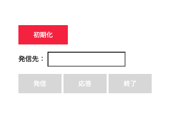
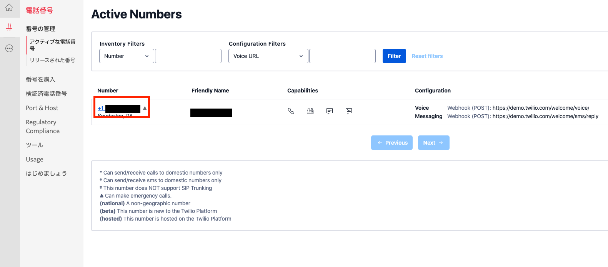
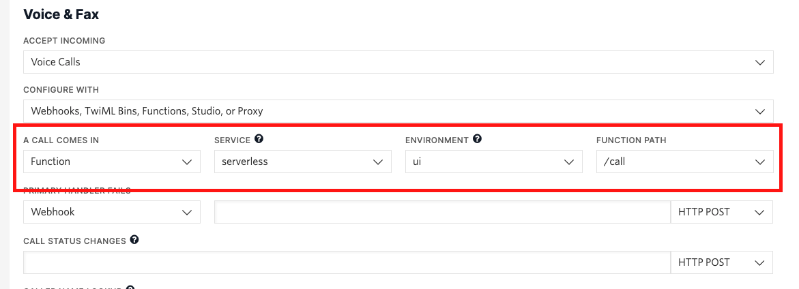

#  手順2: ブラウザフォンで着信に応答

この手順ではクライアント側で着信に応答するロジックを実装します。

## 2-1: ファイルのダウンロード

下記からクライアントアプリケーションのバージョン2をダウンロードし、解凍します。

[ダウンロード phone-v2.zip](../../samples/phone-v2.zip)

先ほどと同様にTwilio Assetsに`VISIBILITY`を`Public`としてアップロードします。必要に応じてデプロイも実施します。

`phone-v2.html`には応答ボタンが追加されており、[Twilio Client JS SDK](https://www.twilio.com/docs/voice/client/javascript)や`voice-v2.js`がロード時に読み込まれます。



## 2-2: 着信時に応答ボタンを有効化

`voice-v2.js`をFunctions & Servicesのエディタで開き、Twilio.Deviceの初期化後に着信時のイベントハンドラを登録します。着信時には`incoming`イベントが発生します。

下記のスニペット内のコメントを参考に実装してください。

```js
// Twilio.Device
let device;
let call;

InitButton.addEventListener('click', async() => {

    let response = await fetch('/token', {
        method: 'GET',
        headers: {
            'Content-Type' : 'application/json'
        }
    });
    let {token} = await response.json();

    device = new Twilio.Device(token);

    device.on('registered', () => {
        CallButton.disabled = false;
        InitButton.disabled = true;
    });

    device.register();

    // 今回追加部分
    // Twilio Clientの着信時に応答ボタンを有効化
    device.on('incoming', (incoming) => {
        CallButton.disabled = true;
        ConnectButton.disabled = false;
        call = incoming;
    });
});
```

## 2-3: 応答ボタンをクリックした際に着信に応答

続けて応答ボタンクリック時の処理を追加します。こちらも下記スニペット内のコメントを参考にしてください。

```js
dialForm.addEventListener('submit', (event) => {

    event.preventDefault();

    const submitId = event.submitter.id;

    if (submitId === 'call') {
        const number = ToField.value;
        CallButton.disabled = true;
        console.log(number);
    
        device.connect({
            params: { number: number}
        });
        DisconnectButton.disabled = false;
    }

    else if (submitId === 'disconnect') {
        device.disconnectAll();
        DisconnectButton.disabled = true;
        CallButton.disabled = false; 
    }

    // 今回追加部分
    // 応答ボタンがクリックされている場合
    else if (submitId === 'connect') {
        // 通話に応答
        call.accept();
        DisconnectButton.disabled = false;
    }        
});
```

これで全ての実装が完了しました。

## 2-4 着信に対して/callパスを指定

最後にTwilio Functionsの`/call`パスを着信時の応答として設定しましょう。[電話番号コンソール](https://www.twilio.com/console/phone-numbers/incoming)を開き、先ほど購入した番号をクリックします。



クリックした番号の詳細画面が表示されます。この`Voice & Fax`セクションまでスクロールし、`A CALL COMES IN`項目を設定します。

`Function`を選択し、`SERVICE`、`ENVIRONMENT`、`FUNCTION PATH`をそれぞれ設定します。下記のスクリーンショットを参考にしてください。




先ほど控えた`phone-v2.html`のURLをブラウザで開き、クライアントを初期化した後、Twilio番号に電話を掛け、ブラウザに着信することを確認しましょう。

----

トライアルアカウントの場合は最初にトライアル版を利用中であるというメッセージが再生されます。全文は下記の通りです。このメッセージはスキップできません。そのため最後までこのメッセージを聞いてください。

> *You have a trial account. You can remove this message at anytime by upgrading to full account. Press any to execute your code.*

メッセージの再生後に何かキーを押すと処理が実行されます。


これで着信にも対応できるブラウザフォンが完成しました。

---
このようにTwiML Appを用いるとブラウザで受発信ができる電話を実装できます。今回のハンズオンで作成したブラウザフォンはURLがわかってしまうと誰でも使えるので、実開発では認証後にページを表示するなどの対策が必要となります。

ハンズオン後にもう使用しない場合は、[Functions](https://www.twilio.com/console/functions/overview/services)からサービスを削除しましょう。

---
